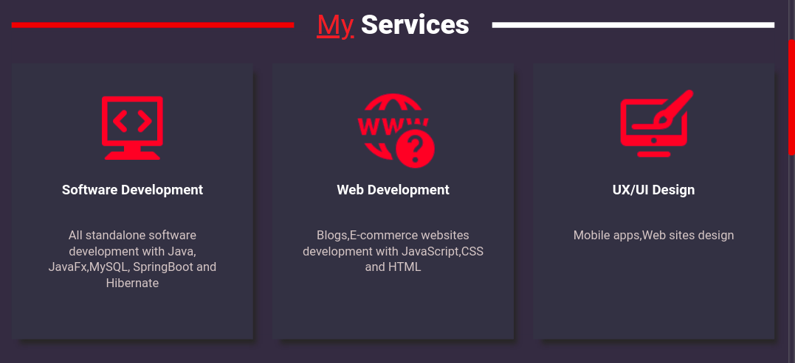
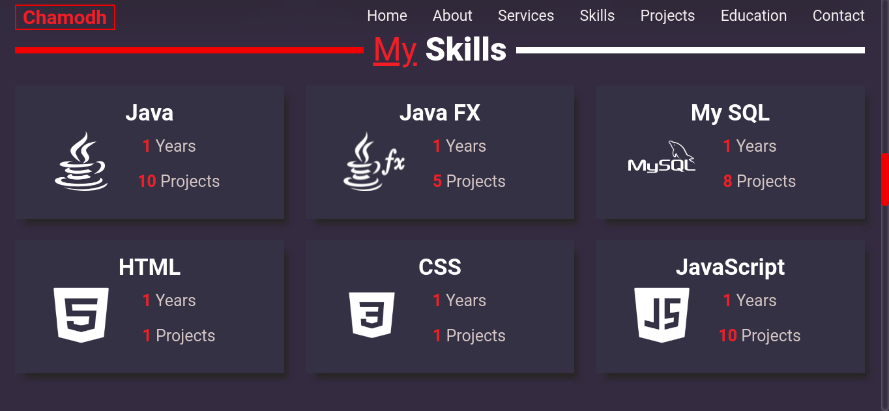
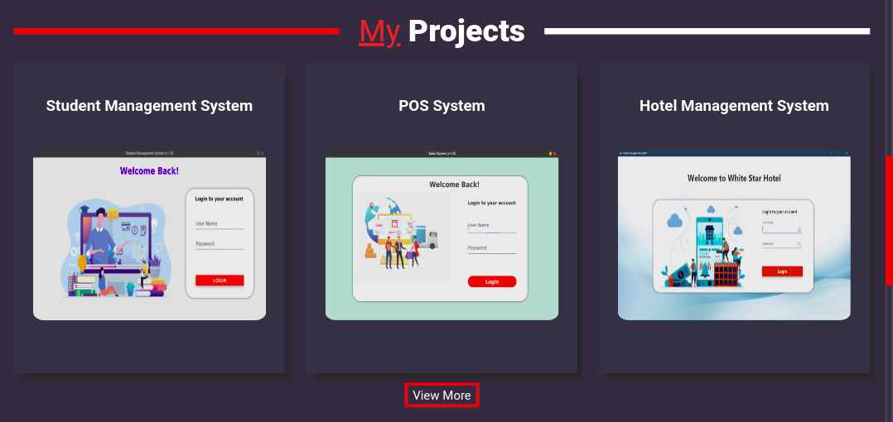

# My Personal Web Site

## Description
#### This website creates for showing some information about my career.I categorize them into few sections...
* Who am I
* What kind of services I provide
* What are the technologies & languages I use
* Projects & assignments I have done
* My contact details

#### Also,this website optimized for all mobile & desktop devices can view 
## Sample Screenshots

## Tech/framework used
* HTML
* CSS
* Java Script

## :link: references

* [Site Map URL](https://www.gloomaps.com/e7KqyYzowP)

* [Wireframe URL](https://wireframe.cc/42HeXW)

* [Mockup URL](https://www.figma.com/file/1RzcDOVsBOEoPqe9lc1DOY/Portfoilo?node-id=0%3A1)

#### This site was built using [GitHub Pages](https://pages.github.com/) and [000WebHost](https://www.000webhost.com/?__cf_chl_jschl_tk__=TO2FoBSzgjuetbZdG7MU8EbIkZukgEsU5byQHnwQ45w-1640521467-0-gaNycGzNCv0)

* [GitHub Pages URL](https://chamodhpasindu.github.io/MyProfile/)

* [000WebHost URL](https://chamodhpasindu.000webhostapp.com/)

**Developed By _Chamodh Pasindu_**